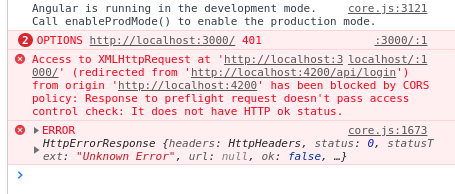

# Backend Development Assignment

Greetings, developers! 👨‍💻

This assignment revolves around extending the functionality of a frontend application by building a corresponding backend. The primary function of this application is to serve as a news feed.

The frontend interacts with your machine via the following address: [https://week35-86108.web.app](https://week35-86108.web.app)

Your task is to develop an API running on [http://localhost:5000](http://localhost:5000), capable of responding to these requests.

I prepared a suite of API tests (in JSON format) using Postman. You can import these tests into your Postman HTTP client or execute them using the Newman CLI. The application is expected fo be fully functional when all tests pass. 

The JSON file containing these tests can be found in the repo under week 35. 

(Absolute URL: `https://github.com/uldahlalex/3rd_semester_exercises/blob/main/week35_make_a_backend_for_this_frontend/MakeABackendForThisFrontendApiTests.json`)  

## API Expectations

*(The tests include pre-request scripts. Some of these scripts call the endpoint to create a new article in order to to "seed/populate" data for testing. That is why you must implement the Create New Article as the first one):*

**Create New Article**: A new article can be created by any user. The new article JSON (Data transfer object) is sent by the client. The API should respond with the new article JSON, including the generated ID (authorId) as ResponseData in the response DTO.

   Endpoint: `POST http://localhost:5000/api/articles`
   
---

**News Feed**: The landing page should display a list of recent news stories. Each post should include a portion of the article text (body) - a maximum of 51 characters, the headline, the image and the ID. However, no author details should be present.

   Endpoint: `GET http://localhost:5000/api/feed`

---

**Full Article Details**: Retrieve an article by ID with full details.

   Endpoint: `GET http://localhost:5000/api/articles/{articleId}`

---

**Delete Article**: An article can be deleted by its ID.

   Endpoint: `DELETE http://localhost:5000/api/articles/{articleId}`

---

**Update Article**: The updated article JSON (Data transfer object) is sent by the client to replace the current article  with that ID. The API should respond with the updated article.

   Endpoint: `PUT http://localhost:5000/api/articles/{articleId}`

---


**Search for Articles**: Users should be able to search for articles. The client will include the search term and page size in the query parameters.

   Endpoint: `GET http://localhost:5000/api/articles?searchterm=X&pagesize=X`

---

### Server side data validation rule requirements:

- The headline must be between 5 and 30 characters (inclusive).
- The body can contain up to 1000 characters.
- The author should be one of the following four journalists: Bob, Rob, Dob, or Lob.
- When searching for articles, the search term should be at least 3 characters, and the page size at least 1. (Search is done by headline and body content)
- All responses should adhere to the JSON format, with `{ "messageToClient": "sometext", "responseData": { } }` being the standard return data transfer object.

For further details, please refer to the API tests that can be imported into Postman from JSON. You can also check out a demonstration of the application with a working backend [here](https://drive.google.com/file/d/1dgtCAWYUcX-tnxnN-MywxyMSwOFewmgm/view?usp=sharing).

## Additional Notes

- The API tests and frontend app won't be aware if you're persisting data or using "in-memory" data like an array. Nonetheless, setting up a database and making queries with Dapper is recommended.
- Since the frontend does not check that the server provides valid data (it is not the client application's responsibility to validate the server's response in a distributed system), your applications may be functional without strict data validation. However, it is always advised to validate data server-side, and this is also the case here.
- You may inspect the test code if you are curious, but it should not be necessary to read anything other than the title of the test.
- A solution guide, as shown in the video, will be available by the end of the week.
- Make sure to enable CORS in Program.cs to avoid request rejection.
- Although this assignment isn't a compulsory assignment, it's strongly recommended, and is a way of assessing that you successfully can implement a program which encompasses all of the first two weeks of curriculum.
- For your convenience, the DB schema used in the solution demonstrated in the video is provided. You may create your own or use this as a starting point:

```sql
CREATE SCHEMA news
CREATE TABLE news.articles(
article_id serial constraint articles_pk primary key,
headline text,
body text,
author text,
article_img_url text
)
```

## Additional help for debugging:
- Use the browser developer tools - in particular the networks tab is helpful. Here you can see the exact HTTP request and response.
   - Some responses you should be particular wary of:
   CORS errors. Looks like this:
   
   Means you should enable CORS middleware inside of Program.cs. My video number 1 goes over this.
   - "No response"; If you don't get a status code, you probably don't have the API running on localhost port 5000. 
   - 405 Method not allowed: This is very often because the HTTP request type does not have a corresponding endpoint (trying to do POST /api/books, but there is only a GET /api/books endpoint on your server)